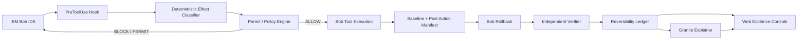
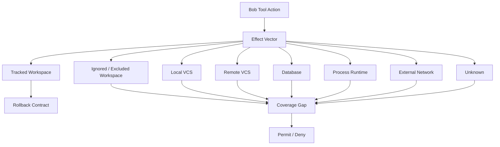

# ARCHITECTURE.md

## Rubicon Architecture

### Overview

Rubicon enforces IBM Bob's rollback boundary through three layered mechanisms:

1. **Pre-execution classification** — every tool action is classified before Bob runs it
2. **Human permit gate** — boundary-crossing actions require a cryptographic human permit
3. **Post-rollback independent verification** — after Bob rollback, each state domain is independently hashed and compared

### Architecture diagram

### Effect domain model

### Component map

| Component | Location | Purpose |
|-----------|----------|---------|
| Classifier | `core/classifier/classifier.py` | Deterministic tool action → effect vector |
| Policy engine | `core/policy/` | Blast-radius fence, role/tool/path rules |
| Permit engine | `core/permits/permit_engine.py` | One-use Ed25519 permit issuance and validation |
| Manifest capturer | `core/manifests/manifest.py` | Pre/post state capture |
| Reconciler | `core/verifier/reconciler.py` | Domain-level comparison, receipt generation |
| Filesystem adapter | `core/adapters/filesystem_adapter.py` | WORKSPACE_TRACKED, OUTSIDE_WORKSPACE |
| Git adapter | `core/adapters/git_adapter.py` | VCS_LOCAL, VCS_REMOTE |
| Process adapter | `core/adapters/process_adapter.py` | PROCESS_RUNTIME |
| SQLite adapter | `core/adapters/sqlite_adapter.py` | DATABASE_STATE |
| HTTP fixture adapter | `core/adapters/http_fixture_adapter.py` | EXTERNAL_NETWORK |
| PreToolUse hook | `scripts/hooks/pretooluse.py` | Bob integration — blocks/permits actions |
| CLI | `cli/rubicon.py` | Human-facing commands: approve, status, keygen |
| FastAPI backend | `app/api/main.py` | REST API for dashboard |
| Next.js frontend | `app/web/` | Landing, dashboard, proof pages |

### Key design decisions

1. **Classifier is purely deterministic** — no AI involved in reversibility decisions
2. **UNKNOWN = unsafe** — the classifier fails closed for all unresolvable inputs
3. **Private key outside workspace** — the agent cannot access the signing key
4. **Permit is one-use** — replay attacks are blocked by consuming the permit on first valid use
5. **Independent verification** — the verifier does not trust Bob's self-report; adapters independently hash domain state
6. **API-deletion invariant** — removing watsonx credentials does not affect any core safety mechanism
